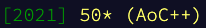

Advent of Code
===

A list of my [Advent of Code](https://adventofcode.com/) solutions in Python. The
repository holds a separate directory for each Advent of Code season:

| Directory (Year)      | Language | Stars                              |
| --------------------- | -------- | ---------------------------------- |
| [/aoc-2021](aoc-2021) | Python   |  |
| [/aoc-2022](aoc-2022) | Python   |                                    | 
