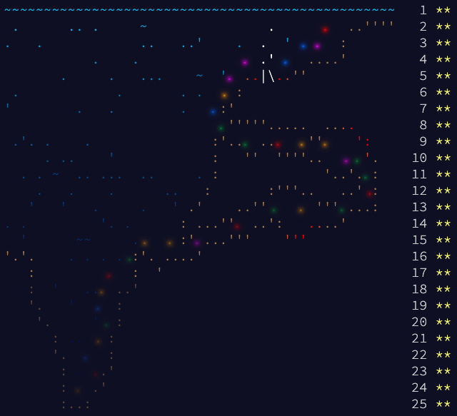

Advent of Code 2021 
===

[Advent of Code 2021](https://adventofcode.com/2021)




## Runtimes

The following results and runtimes are generated with PyPy 3.8.

```
Day 01:
  [Info] Reading input from ../inputs/01.txt...
  [Info] Answer 1: 1722               [   0.002868 sec]
  [Info] Answer 2: 1748               [   0.008127 sec]

Day 02:
  [Info] Reading input from ../inputs/02.txt...
  [Info] Answer 1: 1480518            [   0.005008 sec]
  [Info] Answer 2: 1282809906         [   0.001456 sec]

Day 03:
  [Info] Reading input from ../inputs/03.txt...
  [Info] Answer 1: 3549854            [   0.003136 sec]
  [Info] Answer 2: 3765399            [   0.003533 sec]

Day 04:
  [Info] Reading input from ../inputs/04.txt...
  [Info] Answer 1: 23177              [   0.021563 sec]
  [Info] Answer 2: 6804               [   0.020884 sec]

Day 05:
  [Info] Reading input from ../inputs/05.txt...
  [Info] Answer 1: 6564               [   0.102698 sec]
  [Info] Answer 2: 19172              [   0.127795 sec]

Day 06:
  [Info] Reading input from ../inputs/06.txt...
  [Info] Answer 1: 350917             [   0.000196 sec]
  [Info] Answer 2: 1592918715629      [   0.000408 sec]

Day 07:
  [Info] Reading input from ../inputs/07.txt...
  [Info] Answer 1: 339321             [   0.002799 sec]
  [Info] Answer 2: 95476244           [   0.081796 sec]

Day 08:
  [Info] Reading input from ../inputs/08.txt...
  [Info] Answer 1: 383                [   0.005830 sec]
  [Info] Answer 2: 998900             [   0.019409 sec]

Day 09:
  [Info] Reading input from ../inputs/09.txt...
  [Info] Answer 1: 631                [   0.032731 sec]
  [Info] Answer 2: 821560             [   0.074713 sec]

Day 10:
  [Info] Reading input from ../inputs/10.txt...
  [Info] Answer 1: 316851             [   0.004930 sec]
  [Info] Answer 2: 2182912364         [   0.002399 sec]

Day 11:
  [Info] Reading input from ../inputs/11.txt...
  [Info] Answer 1: 1747               [   0.059988 sec]
  [Info] Answer 2: 505                [   0.093359 sec]

Day 12:
  [Info] Reading input from ../inputs/12.txt...
  [Info] Answer 1: 3000               [   0.097610 sec]
  [Info] Answer 2: 74222              [   1.148373 sec]

Day 13:
  [Info] Reading input from ../inputs/13.txt...
  [Info] Answer 1: 716                [   0.004917 sec]
###  ###   ##  #  # #### ###  #    ### 
#  # #  # #  # # #  #    #  # #    #  #
#  # #  # #    ##   ###  ###  #    #  #
###  ###  #    # #  #    #  # #    ### 
# #  #    #  # # #  #    #  # #    # # 
#  # #     ##  #  # #    ###  #### #  #
  [Info] Answer 2: 0                  [   0.013911 sec]

Day 14:
  [Info] Reading input from ../inputs/14.txt...
  [Info] Answer 1: 2590               [   0.029736 sec]
  [Info] Answer 2: 2875665202438      [   0.076546 sec]

Day 15:
  [Info] Reading input from ../inputs/15.txt...
  [Info] Answer 1: 652                [   0.178090 sec]
  [Info] Answer 2: 2938               [   0.832623 sec]

Day 16:
  [Info] Reading input from ../inputs/16.txt...
  [Info] Answer 1: 895                [   0.016814 sec]
  [Info] Answer 2: 1148595959144      [   0.008914 sec]

Day 17:
  [Info] Reading input from ../inputs/17.txt...
  [Info] Answer 1: 7875               [   0.090279 sec]
  [Info] Answer 2: 2321               [   0.022353 sec]

Day 18:
  [Info] Reading input from ../inputs/18.txt...
  [Info] Answer 1: 4365               [   0.209014 sec]
  [Info] Answer 2: 4490               [   0.694574 sec]

Day 19:
  [Info] Reading input from ../inputs/19.txt...
  [Info] Answer 1: 425                [  50.219131 sec]
  [Info] Answer 2: 13354              [  50.233042 sec]

Day 20:
  [Info] Reading input from ../inputs/20.txt...
  [Info] Answer 1: 5391               [   0.072399 sec]
  [Info] Answer 2: 16383              [   1.534868 sec]

Day 21:
  [Info] Reading input from ../inputs/21.txt...
  [Info] Answer 1: 995904             [   0.003250 sec]
  [Info] Answer 2: 193753136998081    [   0.277626 sec]

Day 22:
  [Info] Reading input from ../inputs/22.txt...
  [Info] Answer 1: 524792             [   0.076637 sec]
  [Info] Answer 2: 1213461324555691   [   1.348804 sec]

Day 23:
  [Info] Reading input from ../inputs/23.txt...
  [Info] Answer 1: 15358              [   8.631386 sec]
  [Info] Answer 2: 51436              [  11.450708 sec]

Day 24:
  [Info] Reading input from ../inputs/24.txt...
  [Info] Answer 1: 59998426997979     [  27.154984 sec]
  [Info] Answer 2: 13621111481315     [  27.167768 sec]

Day 25:
  [Info] Reading input from ../inputs/25.txt...
  [Info] Answer 1: 432                [   0.836031 sec]

-------------------------------------------------------
Total:                                [ 183.106013 sec]
```

## Run a day problem

Run a day problem with the following command:

```bash
python days/{DAY}.py
```

It will automatically use the input file from `inputs/{DAY}.txt`.
If you wish to run custom input, the second argument can be defined,
such as:

```bash
python days/{DAY}.py mytest
```

It will look for the input file `inputs/{DAY}-mytest.txt`.

## Run multiple day problems

If you wish to run multiple, or all, day problems, use the
following command:

```bash
python days/aoc.py [DAY...]
```

Examples:

```bash
python days/aoc.py     # Runs all problems
python days/aoc.py 4 5 # Runs 04 and 05 problems
```

## New day problem

1. Create a sample input file `input/{DAY}-sample.txt` with a problem
   sample input.
3. Create an input file `input/{DAY}.txt` with a problem input.
4. Create a problem script: `days/{DAY}.py` with the following template:

```python
from aoc import run

def get_first(lines):
    # Add solution here...
    return 0

def get_second(lines):
    # Add solution here...
    return 0

if __name__ == '__main__':
    run(get_first, get_second)
```
