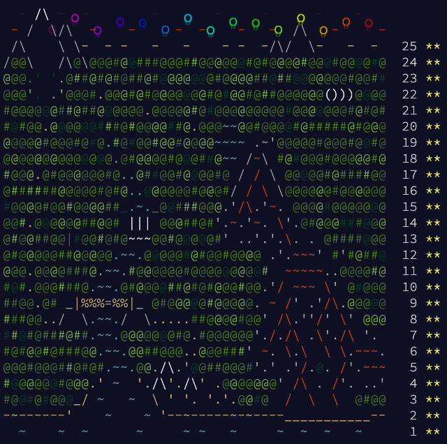

Advent of Code 2022
===

[Advent of Code 2022](https://adventofcode.com/2022)





## Runtimes

The following results and runtimes are generated with PyPy 3.8.

```
Day 01:
  [Info] Reading input from ../inputs/01.txt...
  [Info] Answer 1: 72478              [   0.004287 sec]
  [Info] Answer 2: 210367             [   0.001741 sec]

Day 02:
  [Info] Reading input from ../inputs/02.txt...
  [Info] Answer 1: 14264              [   0.010556 sec]
  [Info] Answer 2: 12382              [   0.006477 sec]

Day 03:
  [Info] Reading input from ../inputs/03.txt...
  [Info] Answer 1: 7850               [   0.001388 sec]
  [Info] Answer 2: 2581               [   0.000696 sec]

Day 04:
  [Info] Reading input from ../inputs/04.txt...
  [Info] Answer 1: 582                [   0.026985 sec]
  [Info] Answer 2: 893                [   0.012905 sec]

Day 05:
  [Info] Reading input from ../inputs/05.txt...
  [Info] Answer 1: DHBJQJCCW          [   0.016481 sec]
  [Info] Answer 2: WJVRLSJJT          [   0.007418 sec]

Day 06:
  [Info] Reading input from ../inputs/06.txt...
  [Info] Answer 1: 1262               [   0.034710 sec]
  [Info] Answer 2: 3444               [   0.002316 sec]

Day 07:
  [Info] Reading input from ../inputs/07.txt...
  [Info] Answer 1: 1182909            [   0.031321 sec]
  [Info] Answer 2: 2832508            [   0.025507 sec]

Day 08:
  [Info] Reading input from ../inputs/08.txt...
  [Info] Answer 1: 1676               [   0.015893 sec]
  [Info] Answer 2: 313200             [   0.047533 sec]

Day 09:
  [Info] Reading input from ../inputs/09.txt...
  [Info] Answer 1: 6339               [   0.085101 sec]
  [Info] Answer 2: 2541               [   0.122832 sec]

Day 10:
  [Info] Reading input from ../inputs/10.txt...
  [Info] Answer 1: 17940              [   0.000187 sec]
####..##..###...##....##.####...##.####.
...#.#..#.#..#.#..#....#.#.......#....#.
..#..#....###..#..#....#.###.....#...#..
.#...#....#..#.####....#.#.......#..#...
#....#..#.#..#.#..#.#..#.#....#..#.#....
####..##..###..#..#..##..#.....##..####.
  [Info] Answer 2: 0                  [   0.000381 sec]

Day 11:
  [Info] Reading input from ../inputs/11.txt...
  [Info] Answer 1: 62491              [   0.024179 sec]
  [Info] Answer 2: 17408399184        [   0.330135 sec]

Day 12:
  [Info] Reading input from ../inputs/12.txt...
  [Info] Answer 1: 380                [   0.132216 sec]
  [Info] Answer 2: 375                [   0.060645 sec]

Day 13:
  [Info] Reading input from ../inputs/13.txt...
  [Info] Answer 1: 6187               [   0.024105 sec]
  [Info] Answer 2: 23520              [   0.092986 sec]

Day 14:
  [Info] Reading input from ../inputs/14.txt...
  [Info] Answer 1: 832                [   0.096559 sec]
  [Info] Answer 2: 27601              [   0.797311 sec]

Day 15:
  [Info] Reading input from ../inputs/15.txt...
  [Info] Answer 1: 5127797            [   0.001080 sec]
  [Info] Answer 2: 12518502636475     [   1.071827 sec]

Day 16:
  [Info] Reading input from ../inputs/16.txt...
  [Info] Answer 1: 1820               [   1.992651 sec]
  [Info] Answer 2: 2602               [1991.056509 sec]

Day 17:
  [Info] Reading input from ../inputs/17.txt...
  [Info] Answer 1: 3127               [   0.307561 sec]
  [Info] Answer 2: 1542941176480      [   0.209082 sec]

Day 18:
  [Info] Reading input from ../inputs/18.txt...
  [Info] Answer 1: 3466               [   0.542632 sec]
  [Info] Answer 2: 2012               [   1.241641 sec]

Day 19:
  [Info] Reading input from ../inputs/19.txt...
  [Info] Answer 1: 1127               [   3.192212 sec]
  [Info] Answer 2: 21546              [1333.944081 sec]

Day 20:
  [Info] Reading input from ../inputs/20.txt...
  [Info] Answer 1: 872                [   0.701239 sec]
  [Info] Answer 2: 5382459262696      [   7.673853 sec]

Day 21:
  [Info] Reading input from ../inputs/21.txt...
  [Info] Answer 1: 82225382988628     [   0.073104 sec]
  [Info] Answer 2: 3429411069028      [   0.039907 sec]

Day 22:
  [Info] Reading input from ../inputs/22.txt...
  [Info] Answer 1: 144244             [   0.073549 sec]
  [Info] Answer 2: 138131             [   0.057617 sec]

Day 23:
  [Info] Reading input from ../inputs/23.txt...
  [Info] Answer 1: 3940               [   0.319435 sec]
  [Info] Answer 2: 990                [   6.626049 sec]

Day 24:
  [Info] Reading input from ../inputs/24.txt...
  [Info] Answer 1: 257                [   1.473435 sec]
  [Info] Answer 2: 828                [   3.731307 sec]

Day 25:
  [Info] Reading input from ../inputs/25.txt...
  [Info] Answer 1: 20=212=1-12=200=00-1 [   0.006969 sec]

-------------------------------------------------------
Total:                                [3356.348587 sec]
```

## Run a day problem

Run a day problem with the following command:

```bash
python days/{DAY}.py
```

It will automatically use the input file from `inputs/{DAY}.txt`.
If you wish to run custom input, the second argument can be defined,
such as:

```bash
python days/{DAY}.py mytest
```

It will look for the input file `inputs/{DAY}-mytest.txt`.

## Run multiple day problems

If you wish to run multiple, or all, day problems, use the
following command:

```bash
python days/aoc.py [DAY...]
```

Examples:

```bash
python days/aoc.py     # Runs all problems
python days/aoc.py 4 5 # Runs 04 and 05 problems
```

## New day problem

1. Create a sample input file `input/{DAY}-sample.txt` with a problem
   sample input.
3. Create an input file `input/{DAY}.txt` with a problem input.
4. Create a problem script: `days/{DAY}.py` with the following template:

```python
from aoc import run

def get_first(lines):
    # Add solution here...
    return 0

def get_second(lines):
    # Add solution here...
    return 0

if __name__ == '__main__':
    run(get_first, get_second)
```
